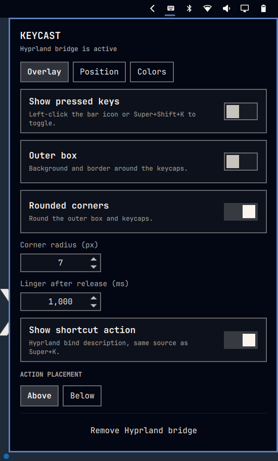
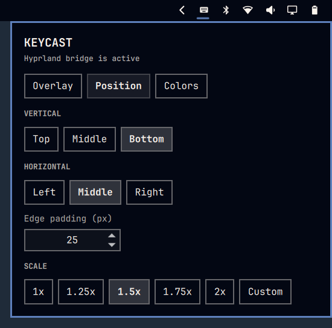
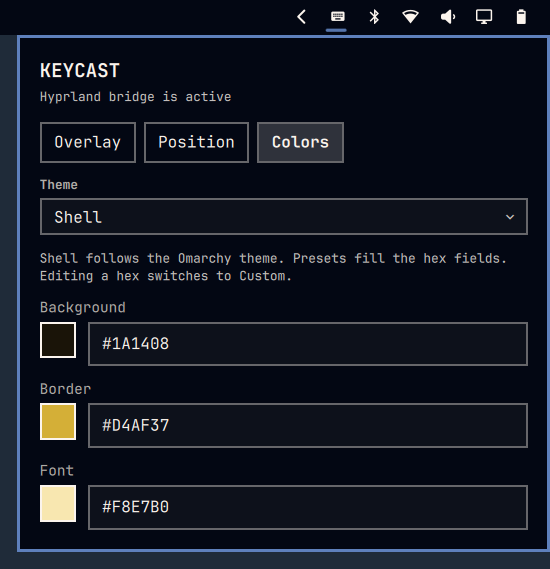

# Keycast (`local.keycast`)

On-screen overlay of currently pressed keys, for screen recordings.

The overlay is a click-through box of keycaps. It defaults to the bottom
center, without an outer box. Position, padding, scale, outer box, corner
rounding, colors, and an optional shortcut action label are configurable.


*Overlay - currently held keys as keycaps, with the Hyprland bind description
underneath. Super+W shows Close window, the same text Super+K lists for that
shortcut. The box is click-through so it does not steal clicks in a recording.*



*Overlay page - right-click the bar icon. Turn the overlay on, optionally preview
a sample hotkey while this panel is open, set outer box, rounding, and a
searchable system font, linger after release, and place the shortcut action
above or below the keys. The Hyprland bridge is installed or removed from this
page.*



*Position page - vertical and horizontal edge (including middle), padding from
the chosen edge, and overlay scale. Custom sits on the same row as the presets
and opens a spin field for 0.5-5.*



*Colors page - every palette is a chip: Shell follows the Omarchy theme and
fills background, border, and font with the colors in use. Neon, Matrix,
Vapor, and the other presets fill those hex fields too. Editing a hex value
switches to Custom.*

## Features

- Shows the keys that are currently held, not a typing history
- Default position: bottom middle
- Configurable vertical edge (`top` / `middle` / `bottom`)
- Configurable horizontal edge (`left` / `middle` / `right`)
- Configurable padding from the chosen edge (0-400 px, default 24; ignored on a middle axis)
- Optional outer box around the keycaps
- Optional corner rounding (0-32 px, default 8)
- Overlay scale (`1x` / `1.25x` / `1.5x` / `1.75x` / `2x` / custom 0.5-5)
- Overlay font: Shell (Omarchy UI font) or any family installed on the system
- Optional shortcut action from Hyprland bind descriptions (same source as Super+K)
- Action placement above or below the keycaps
- Color themes (Shell, Dark, Light, Contrast, Nord, Mocha, Gold, Neon, Matrix, Vapor, Cyber, Ember, Ice) plus custom hex for background, border, and font
- Settings panel can show a live overlay preview of a random real hotkey while open
- Short linger after release (default 600 ms) so quick taps stay visible on video
- Left-click the bar icon to toggle the overlay
- Right-click the bar icon for position, look, and the Hyprland bridge
- IPC: `omarchy-shell local.keycast toggle` (also `show`, `hide`, `state`)

## Privacy

Keycast is an on-screen display for recordings, not a logger.

- No `/dev/input` or evdev listener
- No key history, timestamps, or log files
- Held keycodes live only in Hyprland/Quickshell memory
- The overlay is off until you turn it on
- Disable or remove the Hyprland bridge when you are not recording if you want
  the observer unloaded

## Install

```bash
git clone https://github.com/kenwi/keycast.git ~/Work/keycast
ln -s ~/Work/keycast ~/.config/omarchy/plugins/local.keycast
omarchy plugin enable local.keycast
```

Right-click the keyboard icon on the bar and choose **Enable Hyprland bridge**.
That appends a three-line block to `~/.config/hypr/hyprland.lua` and reloads
Hyprland. Left-click the icon to show the overlay, then hold keys to preview it.

Saved plugin files reload automatically. If the plugin is a symlink, prefer
`omarchy restart shell` after edits so QML definitely reloads.

## Hotkey

Add a bind in `~/.config/hypr/bindings.lua` so you can show or hide the overlay
without clicking the bar. Super+K already opens the keybindings list; Super+Shift+K
is free in Omarchy defaults and stays next to that:

```lua
o.bind("SUPER + SHIFT + K", "Toggle keycast", "omarchy-shell local.keycast toggle")
```

Reload Hyprland after saving. The description appears in Super+K. Pick any unused
combo if you already bound that one. One-way variants:

```lua
o.bind("SUPER + SHIFT + K", "Show keycast", "omarchy-shell local.keycast show")
o.bind("SUPER + SHIFT + L", "Hide keycast", "omarchy-shell local.keycast hide")
```

## Settings

Persisted on the bar entry in `~/.config/omarchy/shell.json`:

```json
{
  "id": "local.keycast",
  "overlayEnabled": false,
  "frameEnabled": false,
  "roundingEnabled": true,
  "rounding": 8,
  "vertical": "bottom",
  "horizontal": "middle",
  "padding": 24,
  "scale": 1,
  "scaleCustom": false,
  "lingerMs": 600,
  "actionEnabled": true,
  "previewEnabled": true,
  "actionPosition": "above",
  "fontFamily": "shell",
  "colorTheme": "shell",
  "backgroundColor": "#1A1A1A",
  "borderColor": "#6E6E6E",
  "fontColor": "#F5F5F5"
}
```

| Key | Values | Default |
|-----|--------|---------|
| `overlayEnabled` | `true` / `false` | `false` |
| `frameEnabled` | `true` / `false` | `false` |
| `roundingEnabled` | `true` / `false` | `true` |
| `rounding` | 0-32 px | `8` |
| `vertical` | `top` / `middle` / `bottom` | `bottom` |
| `horizontal` | `left` / `middle` / `right` | `middle` |
| `padding` | 0-400 px | `24` (ignored on a middle axis) |
| `scale` | `1` / `1.25` / `1.5` / `1.75` / `2`, or `0.5`-`5` when custom | `1` |
| `scaleCustom` | `true` / `false` | `false` |
| `lingerMs` | 0-2000 ms | `600` |
| `actionEnabled` | `true` / `false` | `true` |
| `previewEnabled` | `true` / `false` | `true` |
| `actionPosition` | `above` / `below` | `above` |
| `fontFamily` | `shell` or an installed family name | `shell` |
| `colorTheme` | `shell` / `dark` / `light` / `contrast` / `nord` / `mocha` / `gold` / `neon` / `matrix` / `vapor` / `cyber` / `ember` / `ice` / `custom` | `shell` |
| `backgroundColor` | `#RRGGBB` | `#1A1A1A` |
| `borderColor` | `#RRGGBB` | `#6E6E6E` |
| `fontColor` | `#RRGGBB` | `#F5F5F5` |

CLI examples:

```bash
omarchy bar set local.keycast vertical middle
omarchy bar set local.keycast horizontal middle
omarchy bar set local.keycast padding 40
omarchy bar set local.keycast scale 1.25
omarchy bar set local.keycast scaleCustom true
omarchy bar set local.keycast scale 1.4
omarchy bar set local.keycast frameEnabled false
omarchy bar set local.keycast roundingEnabled false
omarchy bar set local.keycast rounding 12
omarchy bar set local.keycast actionEnabled true
omarchy bar set local.keycast previewEnabled false
omarchy bar set local.keycast actionPosition above
omarchy bar set local.keycast fontFamily "JetBrainsMono Nerd Font"
omarchy bar set local.keycast colorTheme mocha
omarchy bar set local.keycast backgroundColor "#1A1A1A"
omarchy bar set local.keycast borderColor "#6E6E6E"
omarchy bar set local.keycast fontColor "#F5F5F5"
omarchy-shell local.keycast toggle
```

## Layout

| File | Role |
|------|------|
| `manifest.json` | Plugin id, service + bar-widget entry points, settings schema |
| `Service.qml` | Bridge events, overlay state, IPC, settings |
| `Overlay.qml` | Click-through corner box on every monitor |
| `KeycastCard.qml` | Keycap card drawn by the overlay |
| `BarWidget.qml` | Toggle + settings panel host |
| `Panel.qml` | Bridge setup, position, look, colors, linger, action label |
| `Keys.js` | Keycode labels, protocol parse, bind catalog, settings normalize |
| `bridge.lua` | Hyprland `input.keyboard.key` observer |
| `scripts/bridge-control` | Inspect / enable / disable the managed Hyprland block |
| `screenshots/` | Overlay and settings-page images for this README |
| `README.md` | This file |

## Tests

```bash
local.keycast/tests/run
```
