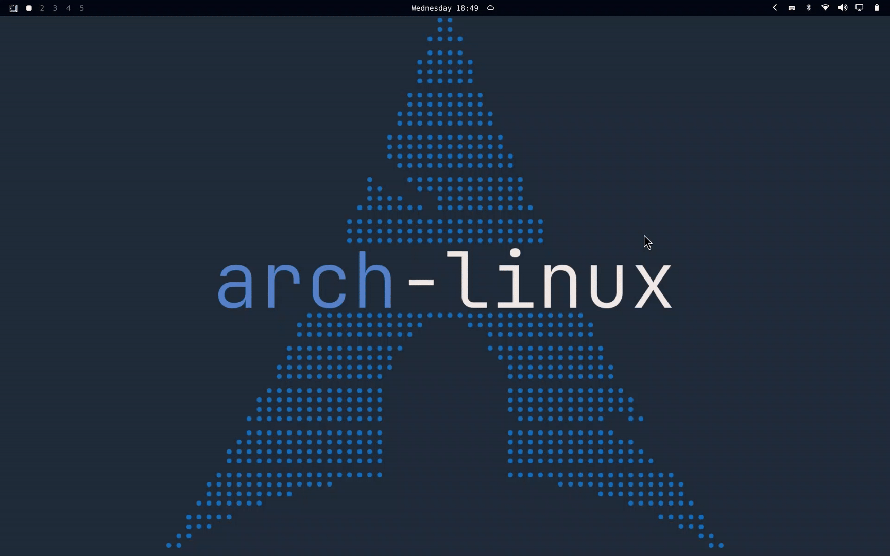
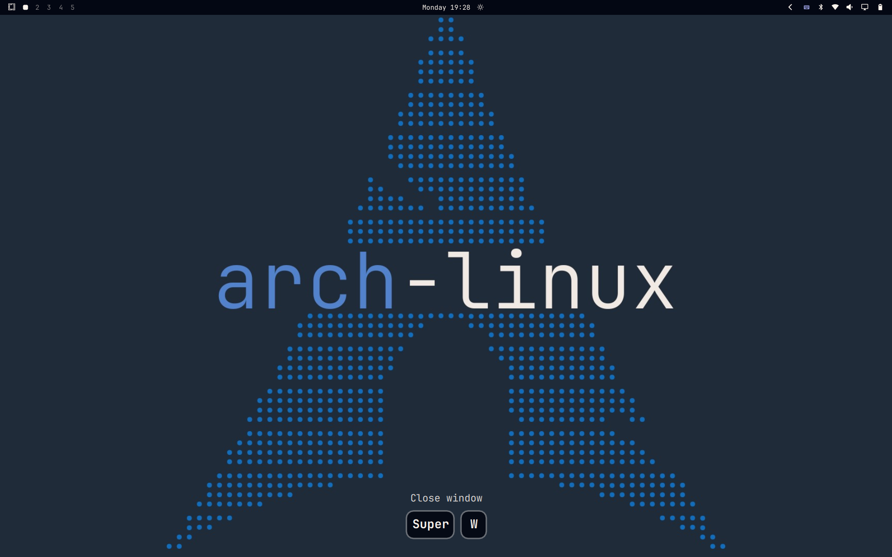
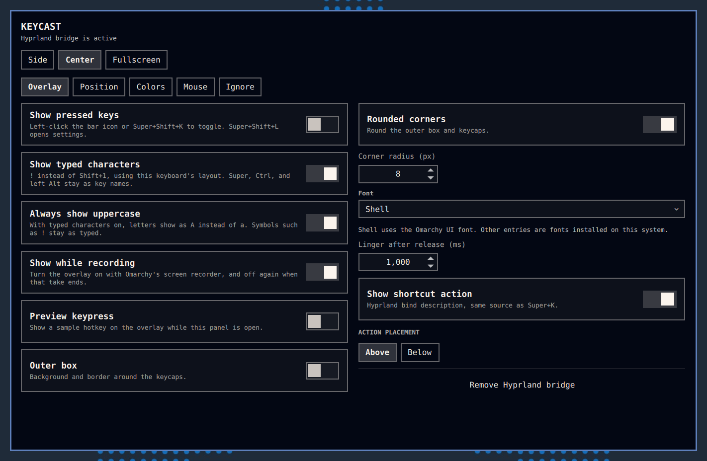
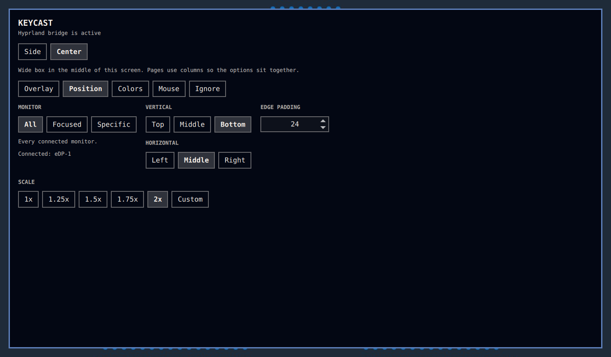
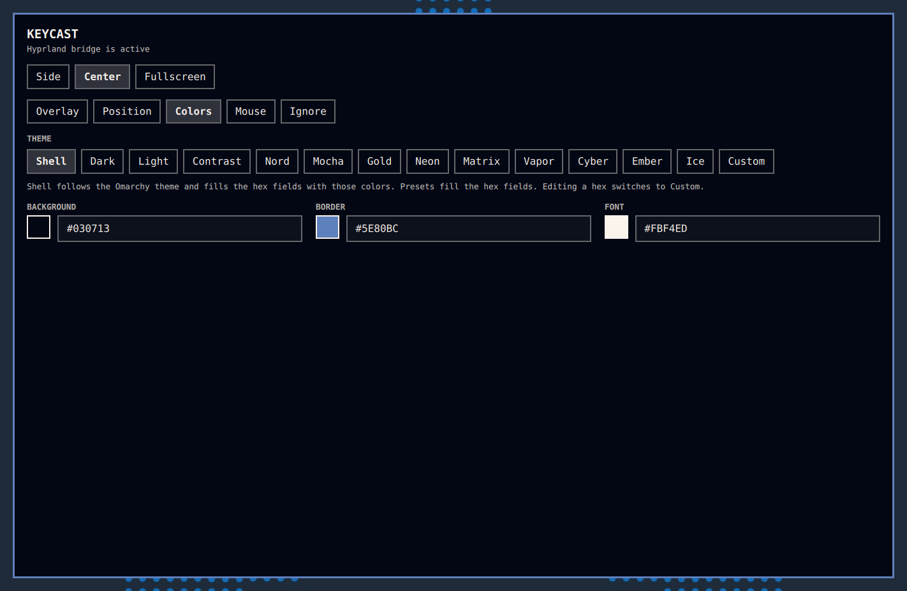
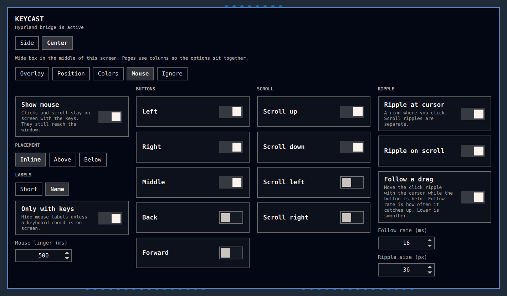
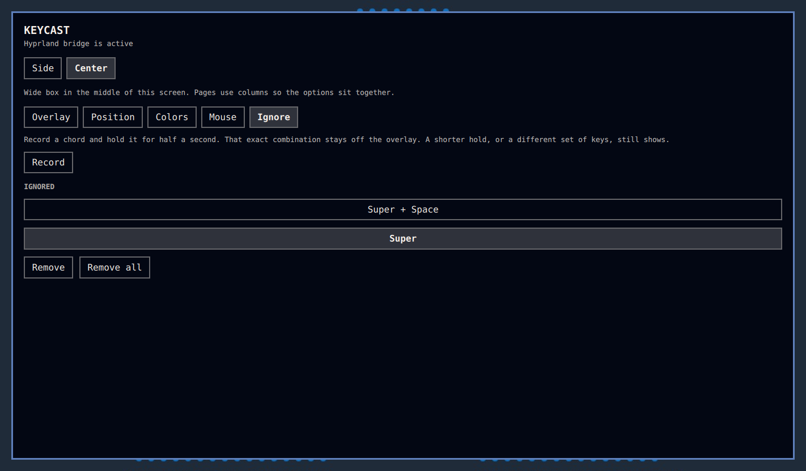
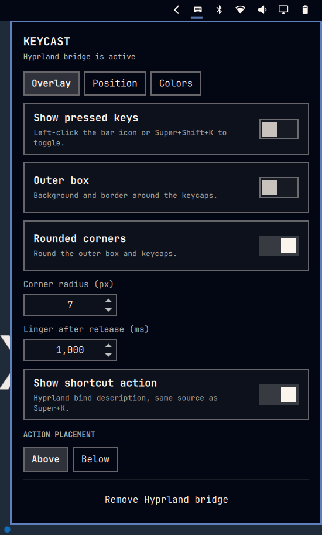
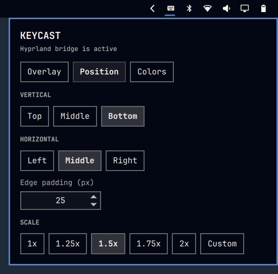
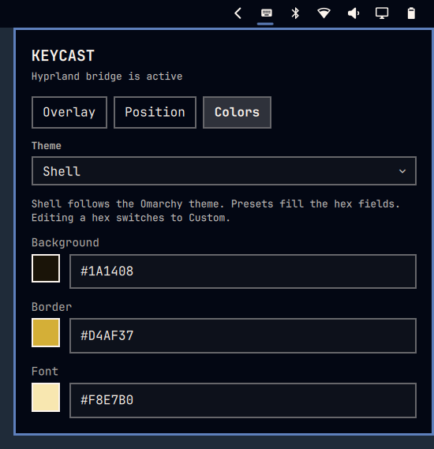

# Keycast

On-screen overlay of currently pressed keys, for screen recordings.

The overlay is a click-through box of keycaps. It defaults to the bottom
center, without an outer box. Position, padding, scale, outer box, corner
rounding, colors, and an optional shortcut action label are configurable.



*Demo - held keys on the overlay (Super+Enter opens a terminal), then the
settings panel: shortcut action, mouse labels beside the chord, position and
custom scale, a color theme, and a click ripple.*



*Overlay - currently held keys as keycaps, with the Hyprland bind description
underneath. Super+W shows Close window, the same text Super+K lists for that
shortcut. The box is click-through so it does not steal clicks in a recording.*

The center layout is a wide box in the middle of the screen. The box stays one
size on every tab.



*Center layout, Overlay page. Side and Center switch the layout. Pressed keys,
typed characters, and the shortcut action sit in columns.*



*Center layout, Position page. Monitor, vertical and horizontal edges, edge
padding, and scale.*



*Center layout, Colors page. Theme chips wrap across the box, with background,
border, and font hex fields underneath.*



*Center layout, Mouse page. Show mouse, placement, and labels sit beside the
button, scroll, and ripple columns.*



*Center layout, Ignore page. Record a chord, then select it and remove it, or
remove all.*

The side layout is the narrow panel beside the bar.



*Side layout, Overlay page. Turn the overlay on, optionally preview a sample
hotkey while this panel is open, set outer box, rounding, and a searchable
system font, linger after release, and place the shortcut action above or below
the keys. The Hyprland bridge is installed or removed from this page.*



*Side layout, Position page. Vertical and horizontal edge (including middle),
padding from the chosen edge, and overlay scale. Custom sits on the same row as
the presets and opens a spin field for 0.5-5.*



*Side layout, Colors page. Every palette is a chip: Shell follows the Omarchy
theme and fills background, border, and font with the colors in use. Neon,
Matrix, Vapor, and the other presets fill those hex fields too. Editing a hex
value switches to Custom.*

## Features

- Shows the keys that are currently held, not a typing history
- Optional typed characters: Shift+1 shows `!` from the active keyboard layout. Super, Ctrl, and left Alt chords stay as key names. Always show uppercase turns those letters into `A` while symbols stay as typed
- Default position: bottom middle
- Configurable vertical edge (`top` / `middle` / `bottom`)
- Configurable horizontal edge (`left` / `middle` / `right`)
- Optional monitor: every screen, the focused monitor, or one specific connector. The default is every screen
- Configurable padding from the chosen edge (0-400 px, default 24; ignored on a middle axis)
- Optional outer box around the keycaps
- Optional corner rounding (0-32 px, default 8)
- Overlay scale (`1x` / `1.25x` / `1.5x` / `1.75x` / `2x` / custom 0.5-5)
- Overlay font: Shell (Omarchy UI font) or any family installed on the system
- Mouse clicks and scroll on their own settings page: which buttons, placement, linger, and an optional cursor ripple. Follow a drag can slide that ripple while the button is held. Fade out lowers its opacity across the ripple linger. Short labels are `LMB` and `Wheel Dn`. Full names are `Left mouse` and `Scroll down`, so they do not match the arrow keys (`Left arrow`, `Right arrow`, `Up arrow`, `Down arrow`)
- Optional shortcut action from Hyprland bind descriptions (same source as Super+K)
- Action placement above or below the keycaps
- Color themes (Shell, Dark, Light, Contrast, Nord, Mocha, Gold, Neon, Matrix, Vapor, Cyber, Ember, Ice) plus custom hex for background, border, and font
- Settings panel can show a live overlay preview of a random real hotkey while open
- Short linger after release (default 600 ms) so quick taps stay visible on video
- Optional show while recording: the overlay follows Omarchy's screen recorder (`gpu-screen-recorder`). It turns off when the take ends only if Keycast turned it on. A manual overlay stays as you left it
- Left-click the bar icon to toggle the overlay
- Right-click the bar icon for Overlay, Position, Colors, Mouse, Ignore, and the Hyprland bridge
- Ignore tab: record a chord by holding it for half a second. That exact combination stays off the overlay. Select one in the list and remove it, or remove all
- Settings layout: Side is the narrow panel beside the bar. Center is a wide box in the middle of the screen, with each page arranged in columns
- IPC: `omarchy-shell keycast toggle` (also `show`, `hide`, `state`). `omarchy-shell keycast settings` opens or closes the settings panel

## Privacy

Keycast is an on-screen display for recordings, not a logger.

- No `/dev/input` or evdev listener
- No key history, timestamps, or log files
- Held keycodes live only in Hyprland/Quickshell memory
- Ignored chords are combinations you record on purpose. They are saved with the other settings, not as a key log
- The overlay is off until you turn it on
- Disable or remove the Hyprland bridge when you are not recording if you want
  the observer unloaded

## Install

```bash
git clone https://github.com/kenwi/keycast.git ~/Work/keycast
ln -s ~/Work/keycast ~/.config/omarchy/plugins/keycast
omarchy plugin enable keycast
```

Right-click the keyboard icon on the bar and choose **Enable Hyprland bridge**.
That appends a three-line block to `~/.config/hypr/hyprland.lua` and reloads
Hyprland. Left-click the icon to show the overlay, then hold keys to preview it.

Saved plugin files reload automatically. If the plugin is a symlink, prefer
`omarchy restart shell` after edits so QML definitely reloads.

## Hotkey

Add a bind in `~/.config/hypr/bindings.lua` so you can show or hide the overlay
without clicking the bar. Super+K already opens the keybindings list; Super+Shift+K
is free in Omarchy defaults and stays next to that:

```lua
o.bind("SUPER + SHIFT + K", "Toggle keycast", "omarchy-shell keycast toggle")
o.bind("SUPER + SHIFT + L", "Keycast settings", "omarchy-shell keycast settings")
```

Reload Hyprland after saving. The description appears in Super+K. Pick any unused
combo if you already bound that one. One-way variants for the overlay:

```lua
o.bind("SUPER + SHIFT + K", "Show keycast", "omarchy-shell keycast show")
o.bind("SUPER + SHIFT + J", "Hide keycast", "omarchy-shell keycast hide")
```

## Settings

Persisted on the bar entry in `~/.config/omarchy/shell.json`:

```json
{
  "id": "keycast",
  "overlayEnabled": false,
  "showWhileRecording": false,
  "showTyped": false,
  "showUppercase": false,
  "frameEnabled": false,
  "roundingEnabled": true,
  "rounding": 8,
  "vertical": "bottom",
  "horizontal": "middle",
  "overlayMonitor": "all",
  "overlayMonitorName": "",
  "settingsLayout": "side",
  "ignoredChords": "",
  "padding": 24,
  "scale": 1,
  "scaleCustom": false,
  "lingerMs": 600,
  "actionEnabled": true,
  "previewEnabled": true,
  "actionPosition": "above",
  "fontFamily": "shell",
  "colorTheme": "shell",
  "backgroundColor": "#1A1A1A",
  "borderColor": "#6E6E6E",
  "fontColor": "#F5F5F5",
  "mouseEnabled": true,
  "mousePlacement": "inline",
  "mouseLabelStyle": "short",
  "mouseLingerMs": 500,
  "mouseRipple": true,
  "mouseRippleSize": 36,
  "mouseRippleMs": 400
}
```

| Key | Values | Default |
|-----|--------|---------|
| `overlayEnabled` | `true` / `false` | `false` |
| `showWhileRecording` | `true` / `false` | `false` |
| `showTyped` | `true` / `false` | `false` |
| `showUppercase` | `true` / `false` | `false` |
| `frameEnabled` | `true` / `false` | `false` |
| `roundingEnabled` | `true` / `false` | `true` |
| `rounding` | 0-32 px | `8` |
| `vertical` | `top` / `middle` / `bottom` | `bottom` |
| `horizontal` | `left` / `middle` / `right` | `middle` |
| `overlayMonitor` | `all` / `focused` / `specific` | `all` |
| `overlayMonitorName` | Hyprland connector, such as `DP-1` | empty |
| `settingsLayout` | `side` / `center` | `side` |
| `ignoredChords` | comma-separated keycode chords, such as `38+133` | empty |
| `padding` | 0-400 px | `24` (ignored on a middle axis) |
| `scale` | `1` / `1.25` / `1.5` / `1.75` / `2`, or `0.5`-`5` when custom | `1` |
| `scaleCustom` | `true` / `false` | `false` |
| `lingerMs` | 0-2000 ms | `600` |
| `actionEnabled` | `true` / `false` | `true` |
| `previewEnabled` | `true` / `false` | `true` |
| `actionPosition` | `above` / `below` | `above` |
| `fontFamily` | `shell` or an installed family name | `shell` |
| `colorTheme` | `shell` / `dark` / `light` / `contrast` / `nord` / `mocha` / `gold` / `neon` / `matrix` / `vapor` / `cyber` / `ember` / `ice` / `custom` | `shell` |
| `backgroundColor` | `#RRGGBB` | `#1A1A1A` |
| `borderColor` | `#RRGGBB` | `#6E6E6E` |
| `fontColor` | `#RRGGBB` | `#F5F5F5` |
| `mouseEnabled` | `true` / `false` | `true` |
| `mouseLeft` / `mouseRight` / `mouseMiddle` | `true` / `false` | `true` |
| `mouseBack` / `mouseForward` | `true` / `false` | `false` |
| `mouseWheelUp` / `mouseWheelDown` | `true` / `false` | `true` |
| `mouseWheelLeft` / `mouseWheelRight` | `true` / `false` | `false` |
| `mouseRequireKeys` | `true` / `false` | `false` |
| `mouseRipple` | `true` / `false` | `true` |
| `mouseRippleScroll` | `true` / `false` | `false` |
| `mouseRippleFollow` | `true` / `false` | `false` |
| `mouseRippleFollowMs` | 8-64 ms | `16` |
| `mouseRippleFade` | `true` / `false` | `false` |
| `mousePlacement` | `inline` / `above` / `below` | `inline` |
| `mouseLabelStyle` | `short` (`LMB`) / `name` (`Left mouse`) | `short` |
| `mouseLingerMs` | 0-2000 ms | `500` |
| `mouseRippleSize` | 8-160 px | `36` |
| `mouseRippleMs` | 100-2000 ms after release | `400` |

CLI examples:

```bash
omarchy bar set keycast vertical middle
omarchy bar set keycast horizontal middle
omarchy bar set keycast padding 40
omarchy bar set keycast scale 1.25
omarchy bar set keycast scaleCustom true
omarchy bar set keycast scale 1.4
omarchy bar set keycast frameEnabled false
omarchy bar set keycast roundingEnabled false
omarchy bar set keycast rounding 12
omarchy bar set keycast actionEnabled true
omarchy bar set keycast previewEnabled false
omarchy bar set keycast actionPosition above
omarchy bar set keycast fontFamily "JetBrainsMono Nerd Font"
omarchy bar set keycast colorTheme mocha
omarchy bar set keycast backgroundColor "#1A1A1A"
omarchy bar set keycast borderColor "#6E6E6E"
omarchy bar set keycast fontColor "#F5F5F5"
omarchy-shell keycast toggle
```

## Layout

| File | Role |
|------|------|
| `manifest.json` | Plugin id, service + bar-widget entry points, settings schema |
| `Service.qml` | Bridge events, overlay state, IPC, settings |
| `Overlay.qml` | Click-through corner box on the chosen monitors |
| `KeycastCard.qml` | Keycap card drawn by the overlay |
| `BarWidget.qml` | Toggle + settings panel host |
| `Panel.qml` | Side panel and centered wide panel |
| `SettingsForm.qml` | Overlay, position, colors, and mouse controls |
| `WidePanel.qml` | Centered settings window |
| `Keys.js` | Keycode labels, typed characters, protocol parse, bind catalog, settings normalize |
| `scripts/typed-chars` | Active layout characters for the typed overlay |
| `bridge.lua` | Hyprland keyboard observer and non-consuming mouse binds |
| `scripts/bridge-control` | Inspect / enable / disable the managed Hyprland block |
| `screenshots/` | Demo GIF, side settings pages, and center layout pages for this README |
| `README.md` | This file |

## Tests

```bash
keycast/tests/run
```
